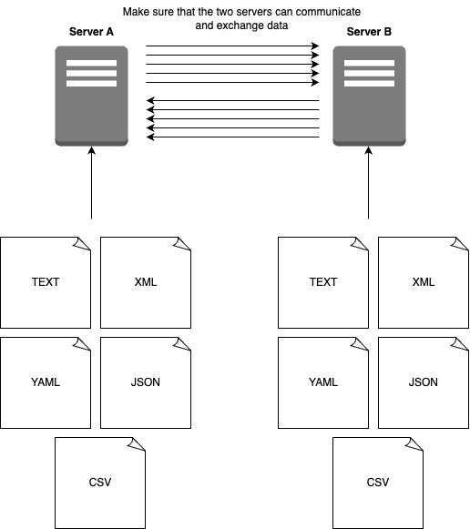

# 03a [Individual] Data parsing server - Part III

**Type**: Individual

This is a continuation of the assignment: Data parsing server - Part I

Create another server in another language than previously. 

Create endpoints for each data parsing task that serves the data. 
There should be an endpoint for each: XML, CSV YAML, TXT and JSON. 

Make the two servers communicate. 

Let's call the server from the assignment Part I (Server A) and the one here (Server B).

If I make a GET request to Server A, it should act as a client for Server B, get the response from Server B and give it to me as a response. 

...and...

If I make a GET request to Server B, it should act as a client for Server A, get the response from Server A and give it to me as a response. 

If you are pressed for time then a full setup is not required as long as you show that you can make two servers communicate.

**Hand-in**: Submit links to the relevant folders in your Github repository.