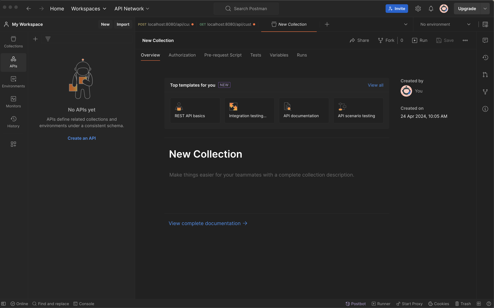
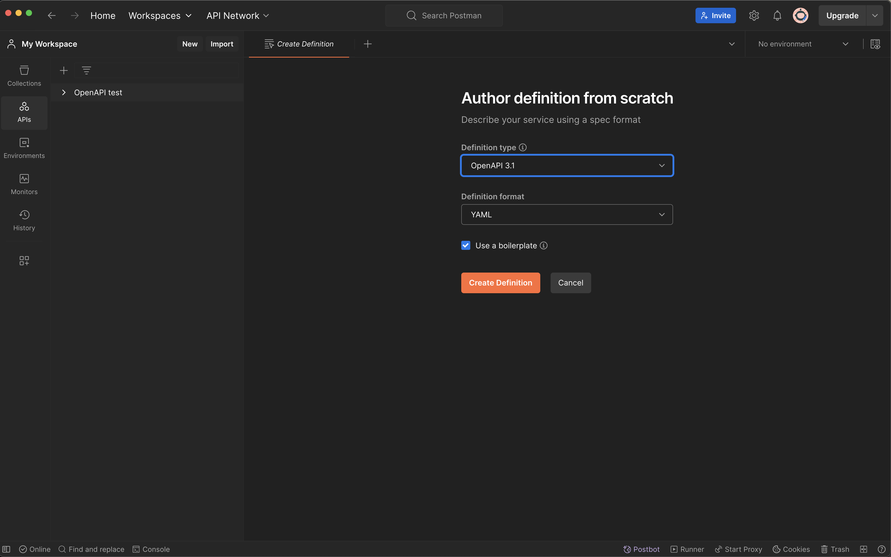

    <h1>OpenAPI</h1>

---

# What is OpenAPI?

- OpenAPI is a specification for APIs.

- Industry standard for describing REST APIs.

- Is a language-agnostic specification.

---

# History: Swagger

1. Swagger: the company behind OpenAPI. 

2. Swagger: also the previous name of the specification before OpenAPI. 

OpenAPI started at version 3.0. A lot has happened from 3.0 to 3.1.0 (allowing JSON schema): https://www.openapis.org/blog/2021/02/16/migrating-from-openapi-3-0-to-3-1-0

---

# APIs <--> OpenAPI

1. **API -> OpenAPI spec**: You can generate OpenAPI documentation from your API.

2. **OpenAPI spec -> API**: There are also tools to generate API code from OpenAPI documentation.

3. **Hybrid**: Write API code and OpenAPI spec simultaneously to document it. 

---

    <h1>How to do it in Postman</h1>

---

# Create collection

You must create a collection in Postman first. A collection is a group of requests. 

---

# Enable Monitors

Click on the icon below `history` in the left side and enable Monitors. 

---

<!-- https://www.youtube.com/watch?v=rG8JGtuhREw -->

# Option 1: Create a new API

Click on the `API` button in the top-left side below `Collections` and in the pane that opens, click on `Create an API`.

---

# Author from scratch

Click the `+` button next to `Definition` and choose `Author from scratch`.

---

# Select `Use a boilerplate`

And OpenAPI version 3.1.

---

    <h1>Exercise: Try to understand the YAML file</h1>

---

# Option 2: Import OpenAPI spec (Paste)

Copy the YAML we generated in the previous exercise and paste it in the editor.

To get the editor, click on the `Import` button in the top-left corner next to `New`.

---

# Option 3: Import OpenAPI spec (Link)

Paste a link where the OpenAPI spec is hosted.

In FastAPI, the `/docs` endpoint retrieves the OpenAPI spec from `/openapi.json`.

